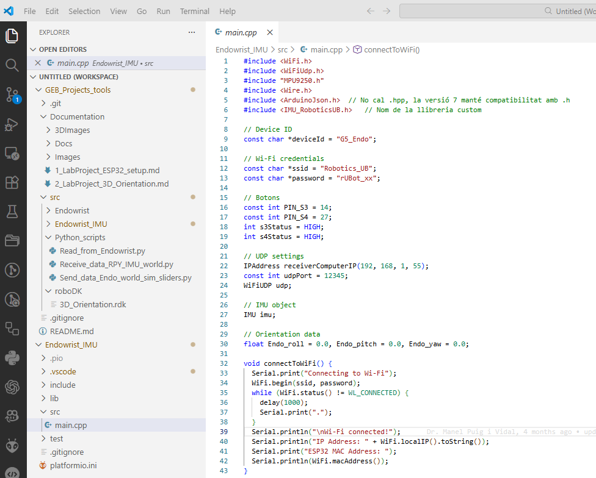
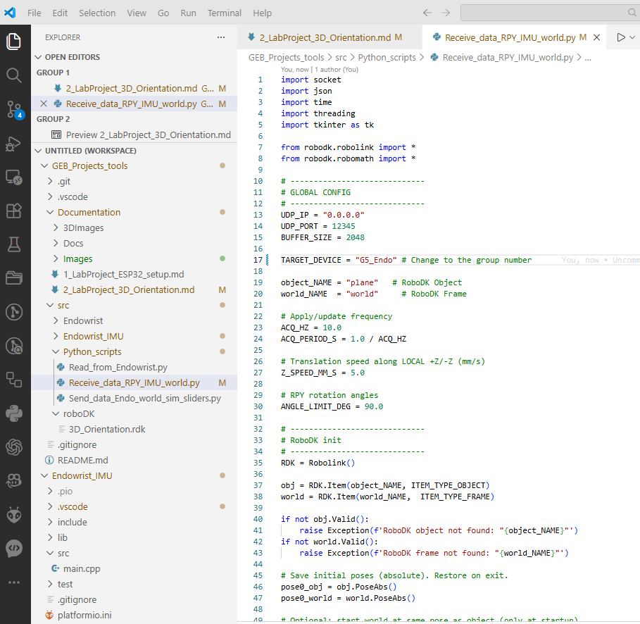

## Case Exemple: 3D orientation in space

In this first exemple we will see how to use an ESP32 based PCB board with an speciffic sensor to obtain the 3D orientation in space

We will use an IMU sensor to obtain 3D orientation in a 3D space.

**Inertial Mass Unit (IMU)** sensor integrates:
- Gyroscope sensor: to measure the angular speed in X-Y-Z axes
- Accelerometer sensor: to measure the linear acceleration in X-Y-Z axes
- Compass sensor: to have a reference to the Geographical World
- A DMP microcontroller to process data and obtain its proper RPY 3-D orientation 

This sensor is mounted on a PCB (Endo-module) with an ESP32 microprocessor to properly read the IMU sensor

### Hardware-Software setup
The **hardware setup** of this Lab session is based on:
- A "Robotics_UB" router: Assigning a fixed IP address to each module (x corresponds to group number)
  - SSID: Robotics_UB
  - Password: 
- Hardware modules:
  - PC control with roboDK program and python scripts (IP:192.168.1.x5)
  - Endo-module board with an ESP32 (IP:192.168.1.x2)

The **software setup** of the first prototype of the DaVinci surgery system is based on:
- Arduino program:
  - `Endowrist_IMU` folder: Arduino program for the Endo_module to obtain the 3D orientation
- RoboDK virtual environment: 
  - `3D_Orientation.rdk`: program in roboDK to visualize a 3D object orientation in a virtual environment 
- Python script programs:
    - `Read_from_Endo.py`: simple reads the RPY Endo-module data
    - `Receive_data_RPY_IMU_world.py`: python program to read the data from the Endo-module and send it to the 3D-orientation object in simulated roboDK program environment (3D_Orientation.rdk)
    - `Send_data_Endo_world_sim_sliders.py`: python program to send test orientation data to the the 3D-orientation object in simulated roboDK program environment (3D_Orientation.rdk)

### Laboratory session Tasks:

The proposed tasks for this first session are:
- Connect properly the Hardware setup
- Upload the `Endowrist_IMU` program to the Endo-module using PlatformIO. Take care about the proper IP address of Endo-module and PC corresponding to your group!.

- Run the `3D_Orientation.rdk` file in the roboDK program to visualize the UR5e robot arm and the Endowrist tool.

- Run the `Receive_data_RPY_IMU_world.py` python program and review the corresponding orientation obtained in the 3D object selectes in roboDK. Take care about the proper Endo-module corresponding to your group!

- Is the orientation correct? why or why not?
- Make the necessary corrections in the python code and verify the correct orientation in roboDK virtual environment.

### Laboratory session delivery

You will have to upload a document including:

- your first operating performances diagnostic, 
- the corrections you have made in the python code
- your final conclusions 