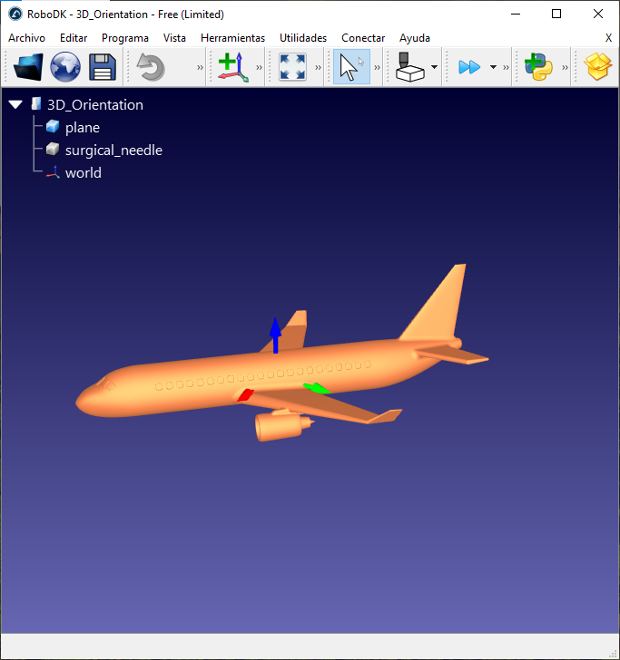
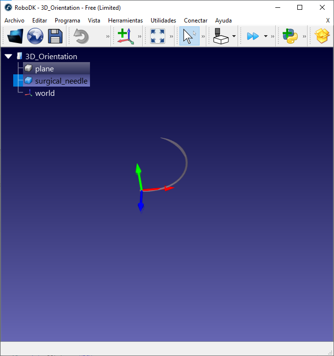

Paula Martínez i Júlia Hollermeier

Biomedical Engineering

# **Lab Session 1: GEB Projects tools**

The aim of this laboratory session was to gain familiarity with the GitHub platform, learn how to set up and use the ESP32 microcontroller, and explore the analysis and implementation of 3D orientation techniques.

## **Environment Setup**
First, we configured the working environment. We created a GitHub account and a project repository using Visual Studio Code, and we updated the code with our credential information (username and email) in order to synchronize it to our GitHub account.

Then, in `platformIO.ini`, we added the "monitor_speed" option to set the serial monitor baud rate to 115200:
 
 ```ini
[env:esp32dev]
platform = espressif32
board = esp32dev
framework = arduino
monitor_speed = 115200
```

Moreover, we replaced the content of `src/main.cpp` with a LED blinking program to verify that the ESP32 is working correctly:

```cpp
#include <Arduino.h>

const int ledPin = 2; // GPIO2, sovint connectat a un LED integrat

void setup() {
  Serial.begin(115200); // Inicialitza el port sèrie
  pinMode(ledPin, OUTPUT);
}

void loop() {
  digitalWrite(ledPin, HIGH);
  Serial.println("Led switched ON");
  delay(1000);

  digitalWrite(ledPin, LOW);
  Serial.println("Led switched OFF");
  delay(1000);
}
```  
After modifying the code, we uploaded it to the ESP32 by connecting it to the computer via USB and clicking the “Upload” button in PlatformIO. 

## **3D Orientation System Setup**

Next, we proceeded with the case example *3D orientation in space* using an IMU sensor.

We started by connecting the hardware setup and uploading the `Endowrist_IMU` program to the Endo-module using PlatformIO. We then configured the IP addresses according to our group:

 ```ini
deviceId = "G4_Endo"
```

Next, we ran the `3D_Orientation.rdk` file in roboDK and executed the `Receive_data_RPY_IMU_world.py` script to visualize the corresponding orientation. Here, we also modified the target device:

 ```ini
TARGET_DEVICE = "G4_Endo"
```

Then, to change the 3D object orientation to "surgical_needle", we modified:

 ```ini
object_NAME = "surgical_needle"
```

Once the object was modified, we observed that when applying rotations, it did not behave as expected. This issue occurred because the coordinate system of the IMU and the local coordinate system of the 3D object in RoboDK were not aligned, leading to incorrect orientation results. Therefore, we needed to physically align the IMU device with the axes of the computer reference frame.

## **Results**

<div align="center">
  
  <p><em>Figure 1: Visualization of the 3D orientation of the plane object in RoboDK.</em></p>
</div>

<div align="center">
  
  <p><em>Figure 2: Visualization of the 3D orientation of the surgical_needle object in RoboDK.</em></p>
</div>

### **Conclusions**

This laboratory session highlighted the importance of coordinate systems when working with 3D orientation. We observed that IMU data cannot be directly applied if the reference frames are not aligned, since different objects may have their own local coordinate systems. Therefore, a transformation is needed to align both systems and ensure that the orientation is displayed correctly.
